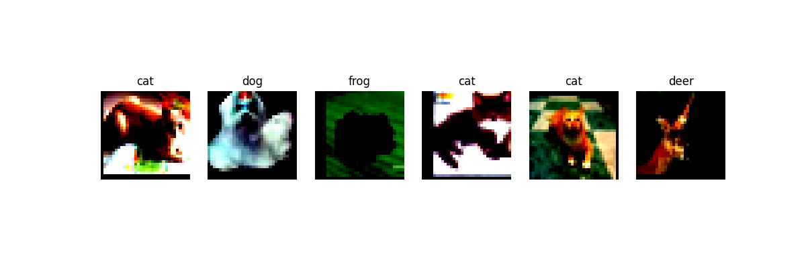
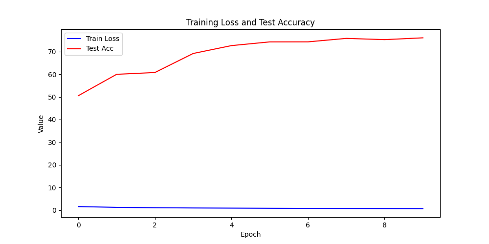

# 友好记忆 - 人脸考勤系统 (face_attendance)

这是一个基于 **YOLOv8 人脸检测** 与 **人脸识别技术** 的自动考勤系统，支持人脸注册、实时识别打卡，并通过数据库记录考勤信息。

## 📁 文件说明
- `main.py`：项目**入口文件**，启动整个考勤系统
- `face_register.py`：人脸注册模块，采集人脸特征并保存到数据库
- `face_recognize.py`：人脸识别模块，使用 YOLOv8 检测人脸并匹配已注册用户
- `attendance_core.py`：考勤核心逻辑，处理识别结果并生成考勤记录
- `db_utils.py`：数据库工具类，封装数据库连接、增删改查等操作
- `yolov8n-face.pt`：YOLOv8n 人脸检测预训练权重文件

## 🛠️ 环境依赖
运行本项目需要以下 Python 库（推荐使用 conda 或 venv 管理环境）：
- Python 3.8+
- ultralytics（YOLOv8 框架）
- opencv-python
- numpy
- face-recognition（或其他人脸识别库）
- sqlite3（或其他数据库驱动，如 pymysql）

可以通过以下命令安装依赖：
```bash
pip install ultralytics opencv-python numpy face-recognition
```

## 🚀 快速开始
1. 克隆本仓库到本地：
   ```bash
   git clone https://github.com/Ytq0809/friendly-memory.git
   cd friendly-memory/face_attendance
   ```
2. 确保 `yolov8n-face.pt` 权重文件已放置在项目目录下
3. 启动系统：
   ```bash
   python main.py
   ```

## 📝 使用流程
1. **人脸注册**：运行 `face_register.py`，录入人员信息并采集人脸特征
2. **考勤打卡**：运行 `main.py`，系统将打开摄像头，实时检测人脸并自动记录考勤
3. **数据查询**：通过 `db_utils.py` 或数据库客户端，查询考勤记录与人员信息

## 🧠 技术原理
- **人脸检测**：使用 YOLOv8n-face 模型快速定位图像中的人脸区域
- **人脸识别**：提取人脸特征向量，与已注册人脸特征进行比对匹配
- **考勤逻辑**：匹配成功后，自动记录当前时间与人员信息，生成考勤记录
- **数据存储**：通过数据库持久化存储人员信息与考勤数据

## 📚 参考资料
- [Ultralytics YOLOv8 官方文档](https://docs.ultralytics.com/)
- [face-recognition 库文档](https://face-recognition.readthedocs.io/)
- [OpenCV 官方文档](https://docs.opencv.org/)


# Friendly Memory - CIFAR-10 图像分类项目

这是一个基于 **CIFAR-10 数据集** 的图像分类实践项目，实现了数据增强、模型训练与训练过程可视化，帮助理解深度学习在图像分类任务中的应用。

## 📁 文件说明
- `CIFAR-10图像分类.ipynb`：项目核心代码，包含数据加载、数据增强、模型构建、训练与评估的完整流程
- `augmented_examples.png`：数据增强示例图，展示了对 CIFAR-10 图像进行增强后的效果
- `training_curve.png`：模型训练曲线可视化图，展示了训练/验证集上的准确率与损失变化

## 🛠️ 环境依赖
运行本项目需要以下 Python 库（推荐使用 conda 或 venv 管理环境）：
- Python 3.8+
- TensorFlow / Keras
- NumPy
- Matplotlib
- Jupyter Notebook

可以通过以下命令安装依赖：
```bash
pip install tensorflow numpy matplotlib jupyter
```

## 🚀 快速开始
1. 克隆本仓库到本地：
   ```bash
   git clone https://github.com/Ytq0809/friendly-memory.git
   ```
2. 进入项目目录，启动 Jupyter Notebook：
   ```bash
   jupyter notebook
   ```
3. 打开 `CIFAR-10图像分类.ipynb`，依次运行所有单元格即可复现训练过程与结果。

## 📊 结果展示
### 数据增强示例


### 训练曲线


## 📝 项目说明
本项目基于 CIFAR-10 数据集（包含 10 类物体的 60000 张 32×32 彩色图像），通过数据增强提升模型泛化能力，使用卷积神经网络（CNN）进行图像分类，并可视化训练过程以监控模型性能。

## 📚 参考资料
- [CIFAR-10 官方网站](https://www.cs.toronto.edu/~kriz/cifar.html)
- [TensorFlow 图像分类教程](https://www.tensorflow.org/tutorials/images/classification)
